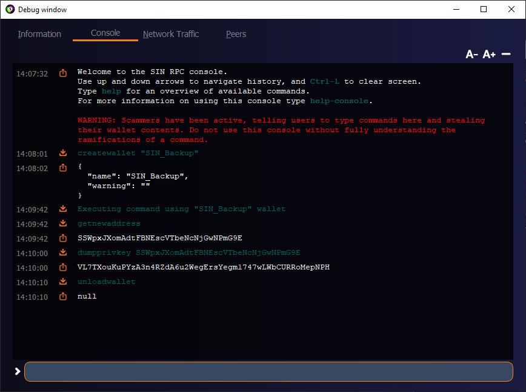
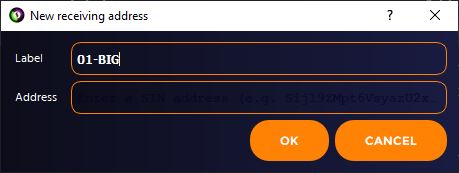
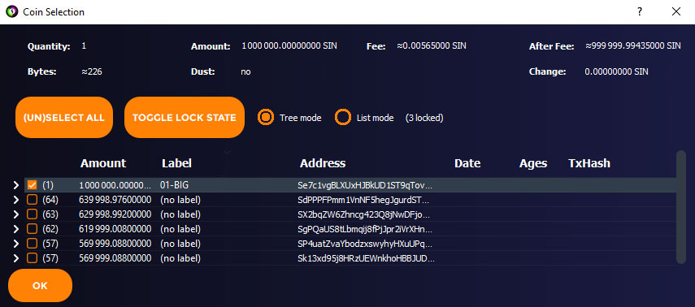
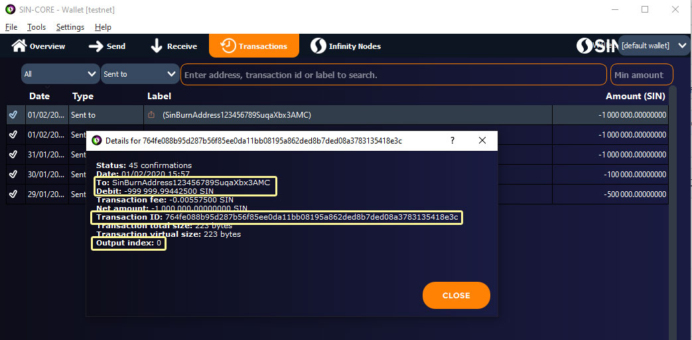
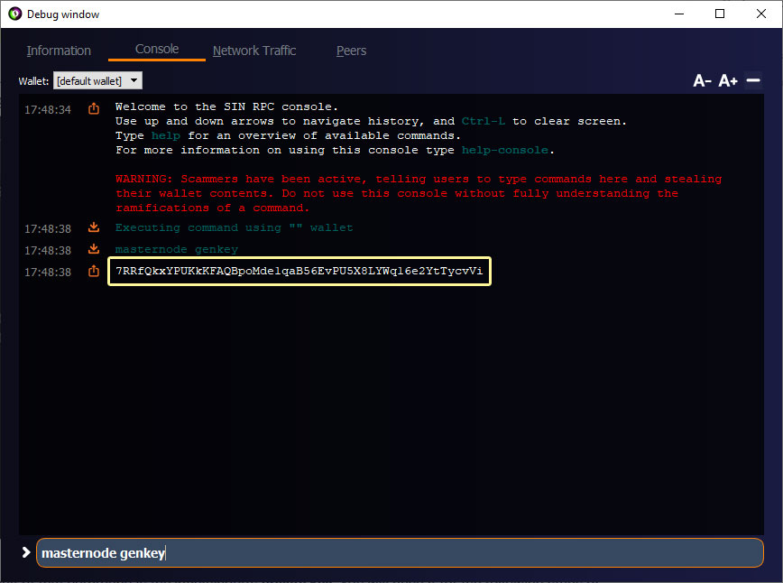
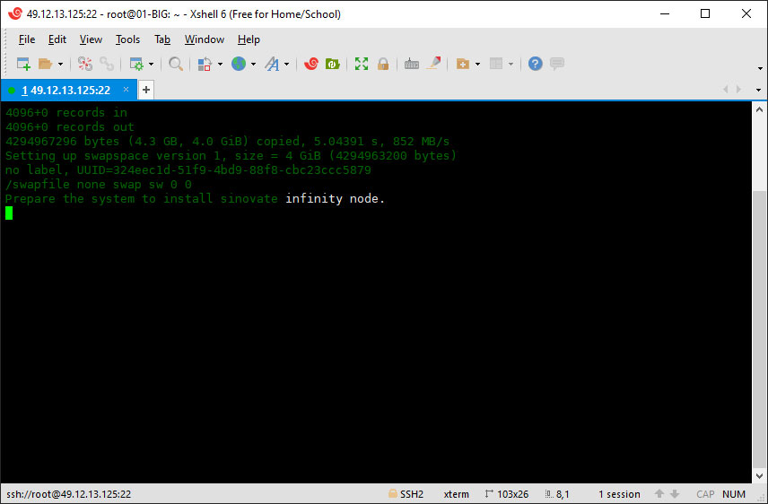
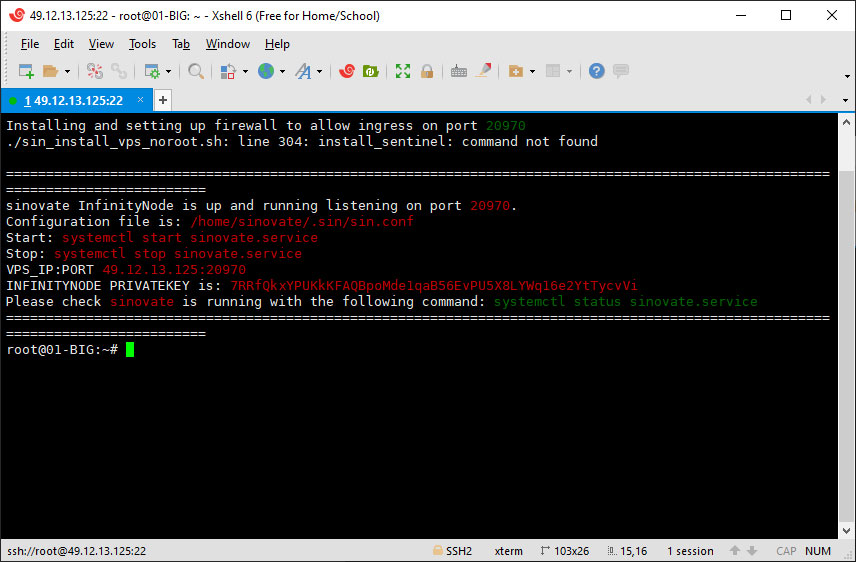
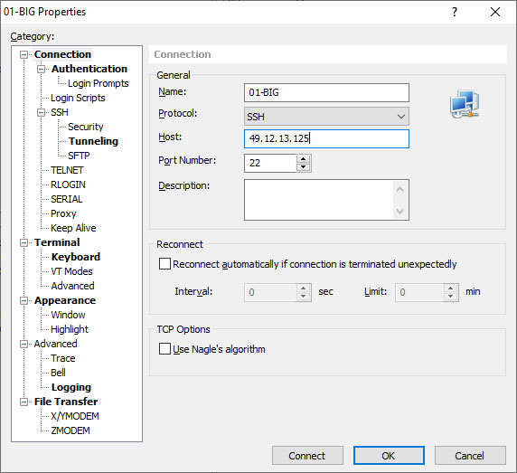
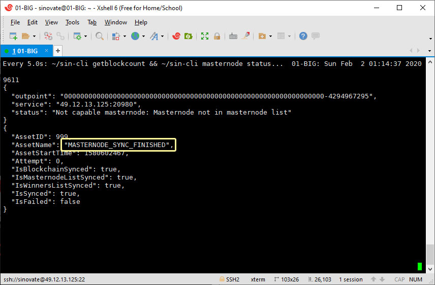
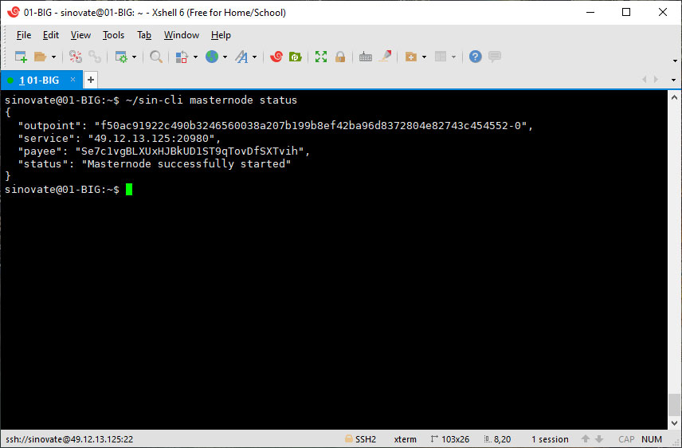

# Infinity Node Setup Guide

:warning: Please, setup only with **Ubuntu 18.04**

## I. PRE-SETUP PREPARATION
- [x] Download and install the Sinovate local wallet from our [Official Github channel](https://github.com/SINOVATEblockchain/SIN-core/releases)
- [x] Purchase the needed Burn and/or Collateral amount from one of the exchanges we're listed on: [TradeOgre](https://tradeogre.com/exchange/BTC-SIN), [Stex.com](https://app.stex.com/en/basic-trade/pair/BTC/SIN/1D), [Crex24](https://crex24.com/exchange/SIN-BTC), [txbit.io](https://txbit.io/Trade/SIN/BTC/?r=c73), [Coinsbit](https://coinsbit.io/trade/SIN_BTC), [Catex](https://www.catex.io/trading/SIN/ETH).
- [x] Send the needed amount to the newly installed local wallet.
- [x] In order to build an Infinity Node, you will require two transactions: the **“BURN”** and the **“Collateral“**.
- [x] Enable coin control on local wallet in `Settings, Options, Wallet` and flag `Enable coin control feature`.
- [x] Create a secondary SIN address from a different wallet, to be used as Backup Address during the Infinity Node creation.


**Infinity Nodes** are of three kinds:

Tier | Burn | Collateral
:--- | :---: | :---:
SIN-MINI | 100,000 SIN | 10,000 SIN
SIN-MID | 500,000 SIN | 10,000 SIN
SIN-BIG | 1,000,000 SIN | 10,000 SIN

The **Burn** amount represents the sum of coins that will be “burnt” and no longer be available for trading.

The **Collateral** (10,000 SIN) will remain locked inside your wallet. Unlocking and moving these coins will disable the node.

## II. STARTING THE SETUP
When you open the wallet, **ALWAYS** let it fully sync. It will take a long time the first time you open it, so, please, be patient.

### 1. SIN Backup Address creation
As further security, a new feature has been included with Infinity Nodes: The **Backup Address**. If for any reason, your PC gets hacked and your local wallet gets compromised, creating a new Infinity Node with a Backup Address from another wallet source will avoid losing your Infinity Node.

Follow the steps below to create a new SIN address **to be used only for this purpose** and maximize your funds' security.

* Open your local SIN wallet
* From the wallet top menu, click on `Help` then on `Debug Window` and `Console`.
* Enter the following command:
```bash
createwallet "SIN_Backup"
```
* :warning: **Make sure to select the new wallet before proceeding.** See screenshot below:


* Now generate the new SIN address in the new wallet:
```bash
getnewaddress
```
* Select and copy the generated SIN address.
* Now get the private key for your new SIN address:
```bash
dumpprivkey YOUR_ADDRESS
```
* :warning: :key: **_SAVE AND SAFELY STORE THE NEW SIN ADDRESS AND THE PRIVATE KEY. YOU WILL BE ABLE TO GET FULL CONTROL OF THE ADDRESS ONLY WITH THE PRIVATE KEY._** :warning: :key:
* Once you have stored your new SIN address and the private key in a safely place, you can now unload the second wallet. Enter the following command:
```bash
unloadwallet
```



* **NOW IT IS EXTREMELY IMPORTANT** that you physically delete the created wallet folder `SIN_Backup` from your computer. Also make sure to empty the bin.
* Close your local SIN wallet.
* Locate the previously created temporary wallet folder on your hard drive:
  * Linux: `~/.sin/wallets/`
  * MAC: `~/Library/Application Support/SIN/wallets/`
  * Windows: `%appdata%\SIN\wallets`
     * (This defaults to `C:\Documents and Settings\YourUserName\Application data\SIN\wallets` on Windows XP and to `C:\Users\YourUserName\Appdata\Roaming\SIN\wallets` on Windows Vista, 7, 8, and 10.)
* Delete the **SIN_Backup** folder.


* Empty your bin.
* Please **use the new generated backup SIN address during the next section** (The Burn transaction).

### 2. The Burn transaction
Open your Sinovate local wallet and create a new receiving address:
* Top menu, click on `File`, then on `Receiving address`
* Label the address (for example: 01-BIG – see screenshot).



* Copy that newly generated address.
* Go to the `Send` tab of the wallet and paste the address in the `Pay To` field.
* In the `Amount` field, enter the **Burn** amount you wish to build your Infinity Node with (100,000 / 500,000 / 1,000,000) – see screenshot below.
* the amount has to be exact, no more, no less.


:warning:**IMPORTANT:** DO NOT check the little checkbox that says `Subtract fee from amount`. Leave it as it is.

* Click **Transactions** tab and wait until the transaction has **2 confirmations**.
* After the confirmations are there, return to the **Send** tab, and click on the `OPEN COIN CONTROL` button.
* A list with balances should open. Select the amount with the BURN amount (in our example it would be the 1,000,000 coins). You select it by checking the little checkbox on its left and click the Ok button to confirm. This will ensure that the next process, the burn transaction, will be done only from that source.



* From the wallet top menu, click on `Help` then on `Debug Window` and `Console`.
  * Before you enter the burn command, make sure you unlock the wallet if your wallet have been encrypted. Open the debug console/window and enter this command: `walletpassphrase password 999` (replace password with your wallet password). The 999 is the number of seconds your wallet will remain unlocked, so any number will do.
* As shown in the screenshot below, enter the burning command in the debug window's bottom field. The command will be `infinitynodeburnfund`, followed by the **BURN amount (100000 / 500000 / 1000000) and followed by the backup address. The backup address must be from another wallet to receive the funds to that wallet in case of a hack of your local wallet.**
* **Make sure the command is entered properly, because you will no longer be able to recover these coins.**
* In the screenshot below we have an example for the SIN-BIG Infinity Node, so the command in that case is
```bash
infinitynodeburnfund 1000000 yourSINbackupaddress
```


:warning: **REMEMBER: THE SCREENSHOT SERVES ONLY AS AN EXAMPLE! If you have any doubts at this point, it's best to contact the Sinovate Support before entering the command without fully understanding the consequences of a mistake.**

* After you entered the BURN command, you will receive an output similar to the one from the screenshot below. 


* From Transaction tab, get the **Burn** transaction information double clicking the transaction. **Copy the Transaction ID and Output Index in Notepad, you will need this info later.**



### 3. The Collateral transaction

Unlike the Burn transaction, which takes the coins out of reach, making them unspendable, the **Collateral Transaction** contains 10,000 SIN coins that **will remain locked inside your local wallet, but fully under your control.**

* Go to the Send tab, in your Sinovate wallet, and send exactly 10,000 SIN to the SAME ADDRESS you used for the BURN transaction.
* From Transaction tab, get the **Collateral** transaction information double clicking the transaction. **Copy the Transaction ID and Output Index in Notepad, you will need this info later.**


### 4. The Infinity Node PRIVKEY

* From the wallet top menu, click on `Help` then on `Debug Window` and `Console`. Type the following command to generate a new masternode privkey: `masternode genkey`. **Copy the privkey in Notepad, you will need this info later.**



### 5. Editing the infinitynode.conf file

* In the wallet's top menu, click on `Tools` and `Open Infinitynode Configuration File`
* On a new row, enter the infinitynode's configuration line as indicated in the next steps, **getting all the needed information you previously copied in Notepad**

**The line is composed of:**

Alias | VPS IP:PORT | privkey | Collateral tx ID | Collateral Output index | Burn tx ID | Burn Output index
:---: | :---: | :---: | :---: | :---: | :---: | :---:

**So it should look like the following example:**

Alias | VPS IP:PORT | privkey | Collateral tx ID | Collateral Output index | Burn tx ID | Burn Output index
:---: | :---: | :---: | :---: | :---: | :---: | :---:
01-BIG | 78.47.162.140:20970 | 7RRfQkxYPUKkKFAQBpoMde1qaB56EvPU5X8LYWq16e2YtTycvVi | 7f48e48e51b487f0a962d492b03debdd89835bc619242be29e720080fc4b2e09 | 0 | 764fe088b95d287b56f85ee0da11bb08195a862ded8b7ded08a3783135418e3c | 0

**Screenshot of the infinitynode.conf file:**


* Save the file, then **Restart the wallet**.

## III. Setting up the VPS

> :warning: Please wait **Collateral** and **Burn** transactions have **15 confirmations** before setting up the VPS.

### A. First Phase

* If you are a Windows user, download and install a SSH client (ie. [Bitvise](https://www.bitvise.com), [Putty](https://www.putty.org/), [Xshell](https://www.netsarang.com/en/xshell/), ecc...)
* Connect to your VPS and enter your new password for first time installation. 
* Then enter the following commands:
```bash
wget https://sinovate.io/downloads/sin_install_vps_noroot.sh
chmod +x sin_install_vps_noroot.sh
./sin_install_vps_noroot.sh
```
* Scrypt will ask you to enter a **new username** for security reasons.
* If you don't enter a new username, the default username will be **sinovate**!
* After the new username, it will ask for a **new password** (choose a strong password that you won't forget).
* The installation will take few minutes, please be patient!



* You will be asked for the **Sinovate Infinitynode Private Key**.
  * You can find it in your `infinitynode.conf` file as indicated in previous step "4. Editing the infinitynode.conf file".
 

 
* First phase of installation is done.



* Logout from your VPS.

### B. Second Phase

* Create a connection profile in your SSH client



> your choosen username during infinity node installation or default sinovate username


* Once connected, type the following commands:

```bash
# your choosen username during infinity node installation or default sinovate username
su sinovate
bash
```


* Enter the following commands to see the synchronization process in real time and wait until you see the **MASTERNODE_SYNC_FINISHED** status. This process can take up to 30 miunutes, please be patient!

```bash
# CTRL+C to exit
# The following command will indicate the current blockheight, masternode status and sync status
watch -n 5 '~/sin-cli getblockcount && ~/sin-cli masternode status && ~/sin-cli mnsync status'
```



* When your Infinity Node sync status is **MASTERNODE_SYNC_FINISHED**, open your local wallet.
* Make sure the Infinity Node tab is enabled in `Settings, Options, Wallet` and flag `Show InfinityNodes Tab`.
* Go to the Infinity Nodes tab, select your node, then click the **START ALIAS** button.
* The Infinity Node should change its status to **PRE_ENABLED**, then **ENABLED** after few minutes.


* However, all masternode cold wallets can sometimes show inaccurate statuses that might trick you into restarting, as mentioned in the small **Note**, above your node(s).
* That's why, you can check the infinitynode's status from the VPS as well.
* On your VPS screen enter the following command, you should see the status: **Masternode successfully started**
```bash
~/sin-cli masternode status
```



**CONGRATULATIONS! YOUR INFINITY NODE IS UP AND RUNNING!**
