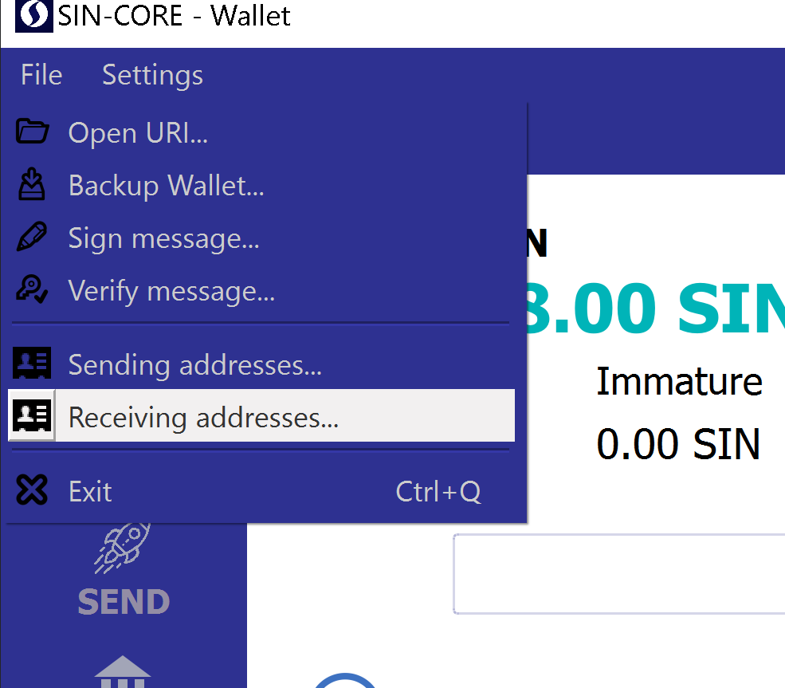
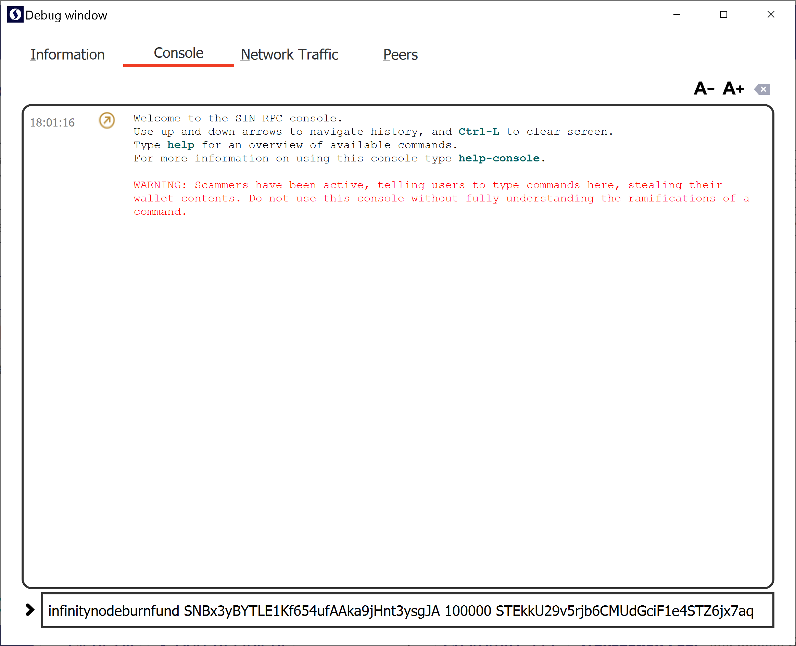
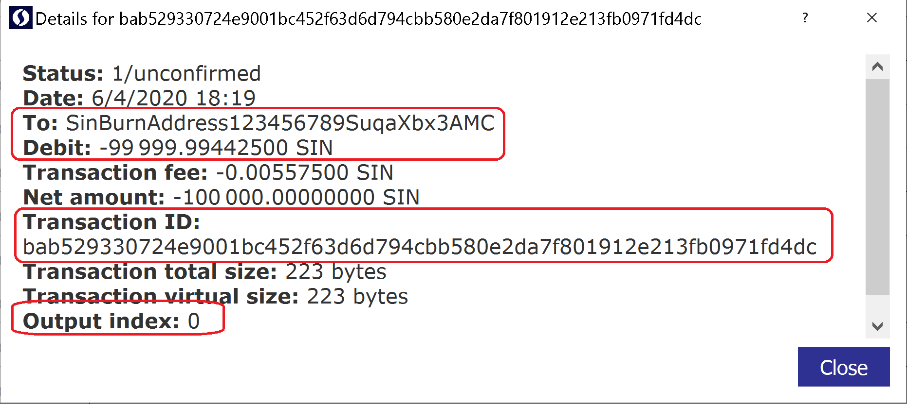

# Infinity Node Setup Guide

!> Please, setup only with **Ubuntu 18.04**

## I. PRE-SETUP PREPARATION

* [x] Download and install the Sinovate local wallet from our [Official Github channel](https://github.com/SINOVATEblockchain/SIN-core/releases/latest)
* [x] If you do not own any SIN yet, purchase the needed Burn and/or Collateral amount from one of the exchanges we're listed on: [TradeOgre](https://tradeogre.com/exchange/BTC-SIN), [Stex.com](https://app.stex.com/en/basic-trade/pair/BTC/SIN/1D), [Crex24](https://crex24.com/exchange/SIN-BTC), [txbit.io](https://txbit.io/Trade/SIN/BTC/?r=c73), [Coinsbit](https://coinsbit.io/trade/SIN_BTC), [Catex](https://www.catex.io/trading/SIN/ETH).
* [x] Send the needed amount to the newly installed local wallet.
* [x] In order to build an Infinity Node, you will require two transactions: the **“BURN”** and the **“Collateral“**.
* [x] Enable coin control on local wallet in `Settings, Options, Wallet` and flag `Enable coin control feature`.
* [x] Create a secondary SIN address from a different wallet, to be used as Backup Address during the Infinity Node creation.

**Infinity Nodes** are of three kinds:

| Tier | Burn | Collateral |
| :--- | :---: | :---: |
| SIN-MINI | 100,000 SIN | 10,000 SIN |
| SIN-MID | 500,000 SIN | 10,000 SIN |
| SIN-BIG | 1,000,000 SIN | 10,000 SIN |

The **Burn** amount represents the sum of coins that will be “burnt” and no longer be available for trading.

The **Collateral** \(10,000 SIN\) will remain locked inside your wallet. Unlocking and moving these coins will disable the node.

## II. STARTING THE SETUP

?> When you open the wallet, **ALWAYS** let it fully sync. It will take a long time the first time you open it, so, please, be patient.

### 1. SIN Backup Address creation

As further security, a new feature has been included with Infinity Nodes: The **Backup Address**. If for any reason, your PC gets hacked and your local wallet gets compromised, creating a new Infinity Node with a Backup Address from another wallet source will avoid losing your Infinity Node.

Follow the steps below to create a new SIN address **to be used only for this purpose** and maximize your funds' security.

* Go to [https://sinovate.io/sin-wallets/](https://sinovate.io/sin-wallets/)
* Download the [Android](https://play.google.com/store/apps/details?id=io.sinovate.wallet) or [Apple IOS](https://apps.apple.com/gb/app/sinovate-wallet/id1483969772) wallet.
* From the receive tab in your mobile wallet, click on `COPY`.


* :warning: **This will be your backup address** See screenshot below:


* Send the **BACKUP** address to your PC from your MOBILE by sending to yourself via E-Mail or any other method you choose.

* :warning: :key: _** YOU WILL BE ABLE TO GET FULL CONTROL OF THE ADDRESS ONLY WITH THE PRIVATE KEY IN CASE YOU GET HACKED. NEVER, UNDER ANY CIRCUMSTANCES, SHARE YOUR PRIVATE KEY WITH ANY OTHER PERSON.**_ :warning: :key:
* Once you received the SIN Backup address , you can now go to your synhcronized PC wallet. 


### 2. The Burn transaction

Open your Sinovate local wallet and create a new receiving address:

* Top menu, click on `File`, then on `Receiving address`
* Label the address \(for example: 01-MINI – see screenshot\).




* Copy that newly generated address.
* Go to the `Send` tab of the wallet and paste the address in the `Pay To` field.
* In the `Amount` field, enter the **Burn** amount you wish to build your Infinity Node with \(100,000 / 500,000 / 1,000,000\) – see screenshot below.
* the amount has to be exact, no more, no less.


:warning:**IMPORTANT:** DO NOT check the little checkbox that says `Subtract fee from amount`. Leave it as it is.

* Click **Transactions** tab and wait until the transaction has **2 confirmations**.
* After the confirmations are there, return to the **Send** tab, and click on the `OPEN COIN CONTROL` button.
* A list with balances should open. Select the amount with the BURN amount \(in our example it would be the 1,000,000 coins\). You select it by checking the little checkbox on its left and click the Ok button to confirm. This will ensure that the next process, the burn transaction, will be done only from that source.


* From the wallet top menu, click on `Settings` then on `Debug Window Console`.
  * Before you enter the burn command, make sure you unlock the wallet if your wallet have been encrypted. Open the debug console/window and enter this command: `walletpassphrase password 999` \(replace password with your wallet password\). The 999 is the number of seconds your wallet will remain unlocked, so any number will do.
* As shown in the screenshot below, enter the burning command in the debug window's bottom field. The command will be `infinitynodeburnfund`, followed by the **BURN amount \(100000 / 500000 / 1000000\) and followed by the backup address.**
* Please use the backup address previously generated from your mobile wallet. \(Section 1. SIN Backup Address creation\)
  * _The backup address must be from another wallet to receive the funds to that wallet in case of a hack of your local wallet._
* **Make sure the command is entered properly, because you will no longer be able to recover these coins.**
* In the screenshot below we have an example for the SIN-MINI Infinity Node, so the command in that case is

  ```
  infinitynodeburnfund yourSINaddress 100000 yourSINbackupaddress
  ```



!> **REMEMBER: THE SCREENSHOT SERVES ONLY AS AN EXAMPLE! If you have any doubts at this point, it's best to contact the Sinovate Support before entering the command without fully understanding the consequences of a mistake.**

* After you entered the BURN command, you will receive an output similar to the one from the screenshot below. 


* From Transaction tab, get the **Burn** transaction information double clicking the transaction. **Copy the Transaction ID and Output Index in Notepad, you will need this info later.**



### 3. The Collateral transaction

Unlike the Burn transaction, which takes the coins out of reach, making them unspendable, the **Collateral Transaction** contains 10,000 SIN coins that **will remain locked inside your local wallet, but fully under your control.**

* Go to the Send tab, in your Sinovate wallet, and send exactly 10,000 SIN to the SAME ADDRESS you used for the BURN transaction.
* From Transaction tab, get the **Collateral** transaction information double clicking the transaction. **Copy the Transaction ID and Output Index in Notepad, you will need this info later.**


!> :warning: Please wait **Collateral** and **Burn** transactions have **15 confirmations** before setting up the VPS.

### 4. The Infinity Node PRIVKEY

* From the wallet top menu, click on `Help` then on `Debug Window` and `Console`. Type the following command to generate a new masternode privkey: `masternode genkey`. **Copy the privkey in Notepad, you will need this info later.**


### 5. Editing the infinitynode.conf file

* In the wallet's top menu, click on `Tools` and `Open Infinitynode Configuration File`
* On a new row, enter the infinitynode's configuration line as indicated in the next steps, **getting all the needed information you previously copied in Notepad**

**The line is composed of:**

| Alias | VPS IP:PORT | privkey | Collateral tx ID | Collateral Output index | Burn tx ID | Burn Output index |
| :---: | :---: | :---: | :---: | :---: | :---: | :---: |


**So it should look like the following example:**

| Alias | VPS IP:PORT | privkey | Collateral tx ID | Collateral Output index | Burn tx ID | Burn Output index |
| :---: | :---: | :---: | :---: | :---: | :---: | :---: |
| 01-MINI | 78.47.162.140:20970 | 7RRfQkxYPUKkKFAQBpoMde1qaB56EvPU5X8LYWq16e2YtTycvVi | 7f48e48e51b487f0a962d492b03debdd89835bc619242be29e720080fc4b2e09 | 0 | 764fe088b95d287b56f85ee0da11bb08195a862ded8b7ded08a3783135418e3c | 0 |

**Screenshot of the infinitynode.conf file:**


* **If the collateral output or the burntx index output gives an outpoint error, please try to change the output.**
* If your output is **0** then please try **1**  or vice versa.
* Save the file, then **Restart the wallet**.

## III. Setting up the VPS
!> :warning: Please wait **Collateral** and **Burn** transactions have **15 confirmations** before setting up the VPS.
### Step 1

Login or Create an account on  [setup.sinovate.io](https://setup.sinovate.io/)

[](https://setup.sinovate.io/templates/sinsetup/template/img/logos/images/image15.png)

### Step 2

When you login click the  **SERVICES**  tab and pick  **ORDER NEW SERVICES**  from the drop down menu

[](https://setup.sinovate.io/templates/sinsetup/template/img/logos/images/image14.png)


### Step 3

Choose your billing cycle,12 months is much better value of course. After you pick your billing cycle click  **CONTINUE**

[](https://setup.sinovate.io/templates/sinsetup/template/img/logos/images/image6.png)

### Step 4

Click  **CHECKOUT**  if you are happy with your order.

[](https://setup.sinovate.io/templates/sinsetup/template/img/logos/images/image4.png)


### Step 5

Enter your email address and also your Discord if you want and then click  **COMPLETE ORDER**

[](https://setup.sinovate.io/templates/sinsetup/template/img/logos/images/image2.png)

### Step 6

PAY the required amount of SIN to the address provided. Please Note  **DO NOT CLOSE THIS PAGE DOWN**

[](https://setup.sinovate.io/templates/sinsetup/template/img/logos/images/image10.png)


### Step 7

Send the  **AMOUNT of SIN coins**  to the address YOU were provided from your invoice in step 6.

[](https://setup.sinovate.io/templates/sinsetup/template/img/logos/images/image11a.png)

### Step 8

You will be then sent to the ORDER CONFIRMATION page.  **Please Note this may take 15 Mins to process to this page**

[](https://setup.sinovate.io/templates/sinsetup/template/img/logos/images/image8.png)


### Step 9

Click  **SERVICES**

[](https://setup.sinovate.io/templates/sinsetup/template/img/logos/images/image17.png)

### Step 10

Click on the  **INFINITY NODE HOSTING**  section

[](https://setup.sinovate.io/templates/sinsetup/template/img/logos/images/image12.png)


### Step 11

Wait for the final confirmation that your  **SERVER**  is ready

[](https://setup.sinovate.io/templates/sinsetup/template/img/logos/images/image16.png)

### Step 12

Once your server is ready you will be given the  **TWO**  pieces of information you need to move over your Infinity Node. These will be in the red boxes I have marked below.

[](https://setup.sinovate.io/templates/sinsetup/template/img/logos/images/image1.png)


### Step 13

Click  **TOOLS**  and open  **INFINITY CONFIGURATION FILE**

[](https://setup.sinovate.io/templates/sinsetup/template/img/logos/images/image13.png)

### Step 14

From the  **INFORMATION**  you got from STEP 12. Place that information into the  **INFINITY NODE CONFIGURATION FILE**  like below. SAVE and CLOSE wallet down

[](https://setup.sinovate.io/templates/sinsetup/template/img/logos/images/image7.png)


### Step 15

Open wallet and let it SYNC and then click the  **INFINITY NODE tab**  
  
Click START ALIAS  
Click YES  
  
_Your INFINITY NODE will then go into Pre-enabled mode and after a short while will say ENABLED_

[](https://setup.sinovate.io/templates/sinsetup/template/img/logos/images/image5.png)

### Step 16

You have  **SUCCESSFULLY**  moved your  **INFINITY NODE**

[Start](https://setup.sinovate.io/getcycle.php)

[](https://setup.sinovate.io/templates/sinsetup/template/img/logos/images/image9.png)


**CONGRATULATIONS! YOUR INFINITY NODE IS UP AND RUNNING!**

