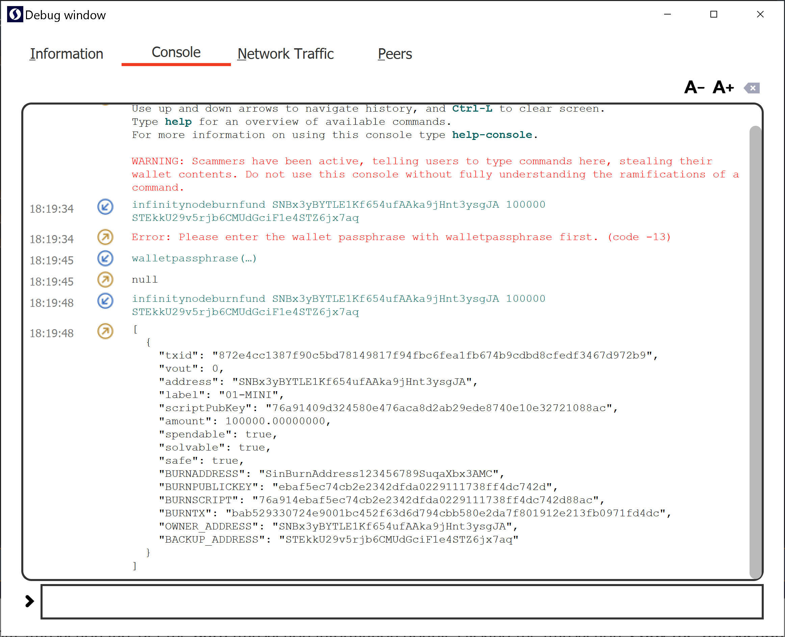
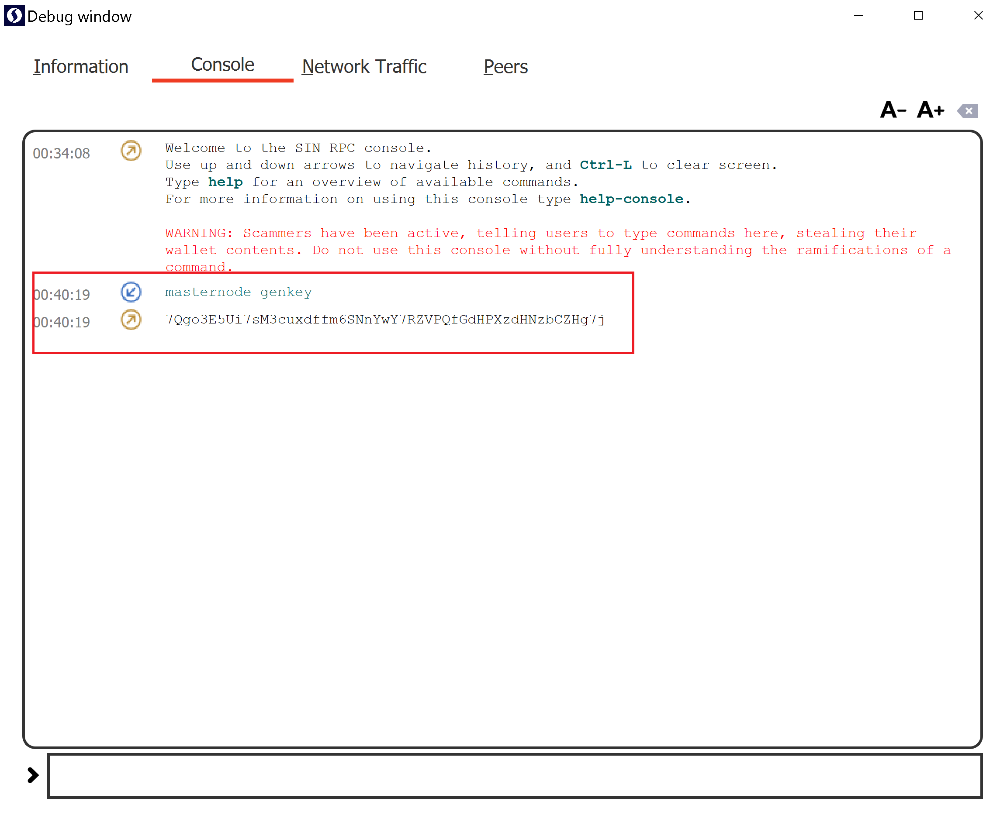

# setUP ile Infinity Kurulum Klavuzu

!> Lütfen yalnızca Ubuntu **18.04** ile kurulum yapın

## I. KURULUM ÖNCESİ HAZIRLIK

* [x] Sinovate yerel cüzdanını indirip yükleyin. [Official Github channel](https://github.com/SINOVATEblockchain/SIN-core/releases/latest)
* [x] Henüz herhangi bir SIN'iniz yoksa, gerekli Yanma ve / veya Teminat tutarını üzerinde listelediğimiz borsalardan birinden satın alın: [TradeOgre](https://tradeogre.com/exchange/BTC-SIN), [Stex.com](https://app.stex.com/en/basic-trade/pair/BTC/SIN/1D), [Crex24](https://crex24.com/exchange/SIN-BTC), [txbit.io](https://txbit.io/Trade/SIN/BTC/?r=c73), [Coinsbit](https://coinsbit.io/trade/SIN_BTC), [Catex](https://www.catex.io/trading/SIN/ETH).
* [x] Gerekli miktarı yeni kurulan yerel cüzdana gönderin.
* [x] Infinity Nodes oluşturmak için iki işleme ihtiyacınız olacaktır: **`YANMA`** ve **`Teminat`**.
* [x] Yerel cüzdanda ` Settings, Options, Wallet ` menüsünden `Enable coin control features` seçeneğini aktif ederek  Coin Control özelliğini etkinleştirin.
* [x] Infinity Nodes oluşturma sırasında Yedekleme Adresi olarak kullanılacak farklı bir cüzdandan ikincil bir SIN adresi oluşturun.

**Infinity Nodes** üç çeşittir:

| Aşama | Yanma | Teminat |
| :--- | :---: | :---: |
| SIN-MINI | 100,000 SIN | 10,000 SIN |
| SIN-MID | 500,000 SIN | 10,000 SIN |
| SIN-BIG | 1,000,000 SIN | 10,000 SIN |

**Yanma** tutarı “yakılacak” ve artık alım satım için kullanılamayacak olan paraların toplamını temsil eder.

**Teminat** \ (10.000 SIN \) cüzdanınızın içinde kilitli kalacaktır. Bu paraların kilidini açmak ve taşımak düğümü devre dışı bırakır.

## II. KURULUMU BAŞLATMA

?> Yerel cüzdanı açtığınızda, **DAİMA** tamamen senkronize olmasına izin verin. İlk açtığınızda uzun zaman alacaktır, bu yüzden lütfen sabırlı olun.

### 1. SIN Yedekleme Adresi oluşturma

Daha fazla güvenlik olarak, Infinity Nodes'a yeni bir özellik eklendi: ** Yedekleme Adresi **. Herhangi bir nedenle PC'nizin saldırıya uğraması ve yerel cüzdanınızın güvenliği ihlal edilirse, başka bir cüzdan kaynağından Yedekleme Adresi ile yeni bir Infinity Node oluşturulabilir.
Yeni bir SIN adresi oluşturmak için aşağıdaki adımları izleyin **sadece bu amaçla kullanılmalıdır** ve paranızın güvenliğini en üst düzeye çıkarır.

* [https://sinovate.io/sin-wallets/](https://sinovate.io/sin-wallets/) adresine gidin.
* [Android](https://play.google.com/store/apps/details?id=io.sinovate.wallet) yada [Apple IOS](https://apps.apple.com/gb/app/sinovate-wallet/id1483969772) cüzdanını indirin
* Mobil cüzdanınızdaki alma sekmesinden `KOPYALA` yı tıklayın.


* :warning: **Bu, yedek adresiniz olacaktır** Aşağıdaki ekran görüntüsüne bakın:


* **YEDEK** adresini E-Posta veya seçtiğiniz başka bir yöntemle  Mobil uygulamanızdan PC'nize gönderin.
* :warning: :key: _**YENİ SIN ADRESİNİ VE ÖZEL ANAHTARI MUHAFAZA EDİN VE GÜVENLİ BİR ŞEKİLDE SAKLAYIN SADECE ÖZEL ANAHTAR İLE ADRESİN TAM KONTROL EDİLMESİ GEREKİR. ASLA HERHANGİ BİR DURUMDA, ÖZEL ANAHTARINIZI DİĞER BİR KİŞİ İLE PAYLAŞMAYIN**_ :warning: :key:
* SIN Backup adresini aldıktan sonra, senkronize PC cüzdanınıza gidebilirsiniz. 


### 2. Yanma İşlemi

Sinovate yerel cüzdanınızı açın ve yeni bir alıcı adresi oluşturun:

* Üst menüde, `File` ve ardından `Receiving Address` e tıklayın
* Adresi etiketleyin \(Örneğin: 01-MINI – ekran görüntüsüne bakın\).


* Yeni oluşturulan adresi kopyalayın.
* Cüzdanın `Send` sekmesine gidin ve adresi `Pay to` alanına yapıştırın.
* `Amount` alanında, Infinity Node oluşturmak istediğiniz **Yanma** miktarını girin \(100,000 / 500,000 / 1,000,000\) – aşağıdaki ekran görüntüsüne bakın.
* Miktar tam olmalıdır, ne daha fazla, ne daha az olmamalıdır.


:warning:**ÖNEMLİ:** `Subtract fee from amount` yazan küçük onay kutusunu **İŞARETLEMEYİN**. Olduğu gibi bırakın.

* **Transactions** sekmesini tıklayın ve işlemin **2 onay** almasını bekleyin.
* Onaylar geldikten sonra **Send** sekmesine dönün ve ` OPEN COIN CONTROL ` düğmesine tıklayın.
* Miktarlar içeren bir liste açılmalıdır. Yanma miktarını karşılayacak miktarı seçin \(Örneğimizde bu 100000 SIN olurdu\). Solundaki küçük onay kutusunu işaretleyerek seçin ve onaylamak için Tamam düğmesini tıklayın. Bu, bir sonraki işlem olan yanma işleminin yalnızca bu kaynaktan yapılmasını sağlayacaktır.


* Cüzdan üst menüsünde, önce `Settings` ve ardından `Debug Window Console`  seçeneklerini tıklayın.
  * Yanma komutunu girmeden önce, cüzdanınız şifrelenmişse cüzdanın kilidini açtığınızdan emin olun. `Debug Console` / penceresini açın ve şu komutu girin: `walletpassphrase şifre 999` \(şifreyi cüzdan şifrenizle değiştirin\). 999, cüzdanınızın kilidinin açık kalacağı saniye sayısıdır, bunu yeterli herhangi bir sayı yapabilirsiniz.
* Aşağıdaki ekran görüntüsünde gösterildiği gibi, hata ayıklama penceresinin alt alanına yazma komutunu girin. Komut `infinitynodeburnfund` olacaktır, ardından **YANMA miktarı \(100000 / 500000 / 1000000\) ve ardından yedek adres gelir.**
* Lütfen mobil cüzdanınızdan daha önce oluşturulan yedek adresi kullanın. \(Bölüm 1. SIN Yedekleme Adresi oluşturma\)
  * _Yerel cüzdanınızın elegeçirilmesi durumunda bu cüzdana para alabilmek için yedek adresin başka bir cüzdandan olması gerekir._
* **Komutun düzgün girildiğinden emin olun, çünkü bu paraları artık kurtaramazsınız.**
* Aşağıdaki ekran görüntüsünde SIN-MINI Infinity Node için bir örneğimiz var, bu durumda komut

  ```
  infinitynodeburnfund 100000 sizinSINyedekadresiniz
  ```


!> **UNUTMAYIN: BU EKRAN SADECE ÖRNEK AMAÇLIDIR! Bu noktada herhangi bir şüpheniz varsa, bir hatanın sonuçlarını tam olarak anlamadan komutu girmeden önce Sinovate Destek ile iletişime geçmek en iyisidir.**

* YANMA komutunu girdikten sonra, aşağıdaki ekran görüntüsündekine benzer bir çıktı alırsınız.



* İşlem sekmesinden, işlemi çift tıklayarak **Yanma** işlem bilgilerini alın. **Transaction ID ve Output Index'ini Not Defteri'ne kopyalayın, daha sonra bu bilgilere ihtiyacınız olacaktır.**


### 3. Teminat işlemi

Madeni paraları ulaşılamaz hale getiren Yanma işleminden farklı olarak, **Teminat İşlemi** yerel cüzdanınızın içinde kilitli kalacak, ancak tamamen kontrolünüz altında kalacak olan 10.000 SIN madeni para içerir.

* Sinovate cüzdanınızdaki `Send` sekmesine gidin ve YANMA işlemi için kullandığınız AYNI ADRES'e tam olarak 10.000 SIN gönderin.
* Transaction sekmesinden, **Teminat** işlem bilgisini işleme çift tıklayarak alın. **Transaction ID ve Output Index'ini Not Defteri'ne kopyalayın, daha sonra bu bilgilere ihtiyacınız olacaktır.**


!> :warning: VPS'i kurmadan önce lütfen **Collateral** ve **Burn** işlemlerinin **15 onay** olmasını bekleyin.
### 4. Infinity Node PRIVKEY

* Cüzdan üst menüsünde, önce `Help` ve ardından `Debug Window Console` seçeneklerini tıklayın. Yeni bir masternode privkey oluşturmak için şu komutu yazın: `masternode genkey`. **Not Defteri'ne bu özel anahtarı kopyalayın, bu bilgiye daha sonra ihtiyacınız olacak.**



### 5. infinitynode.conf dosyasını düzenleme

* Cüzdanın üst menüsünde ` Tools` ve `Open Infinitynode Configuration File` ı tıklayın.
* Yeni bir satıra, sonraki adımlarda gösterildiği gibi infinitynode yapılandırmasının satırını girin, **daha önce Not Defteri'nde kopyaladığınız tüm gerekli bilgileri elde edin**

**Satır şunlardan oluşur:**

| Alias | VPS IP:PORT | privkey | Collateral tx ID | Collateral Output index | Burn tx ID | Burn Output index |
| :---: | :---: | :---: | :---: | :---: | :---: | :---: |


**Bu yüzden aşağıdaki örnek gibi görünmelidir:**

| Alias | VPS IP:PORT | privkey | Collateral tx ID | Collateral Output index | Burn tx ID | Burn Output index |
| :---: | :---: | :---: | :---: | :---: | :---: | :---: |
| 01-MINI | 78.47.162.140:20970 | 7RRfQkxYPUKkKFAQBpoMde1qaB56EvPU5X8LYWq16e2YtTycvVi | 7f48e48e51b487f0a962d492b03debdd89835bc619242be29e720080fc4b2e09 | 0 | 764fe088b95d287b56f85ee0da11bb08195a862ded8b7ded08a3783135418e3c | 0 |

**infinitynode.conf dosyasının ekran görüntüsü:**


* **Teminat çıktısı veya burntx endeksi çıktısı bir çıkış noktası hatası veriyorsa, lütfen çıktıyı değiştirmeyi deneyin.** Çıktınız **0** ise, lütfen **1** veya tersini deneyin.* Dosyayı kaydedin, sonra **Cüzdanı yeniden başlatın**.*

## III. VPS kurulumu

!> :warning: VPS kurulumundan önce lütfen **Teminat** ve **Yanma** işlemlerinin **15 onay** almasını bekleyin.

### İlk Aşama
[setup.sinovate.io](https://setup.sinovate.io/) adresine gidin. Mevcut bir hesabınız yoksa bir hesap oluşturun.

[](https://setup.sinovate.io/templates/sinsetup/template/img/logos/images/image15.png)

### Step 2

Giriş yaptığınızda **SERVICES** sekmesini tıklayın ve açılır menüden **ORDER NEW SERVİCES** 'i seçin

[](https://setup.sinovate.io/templates/sinsetup/template/img/logos/images/image14.png)


### Step 3

Fatura döngünüzü seçin, 12 ay elbette çok daha iyi bir değerdir. Faturalandırma döngünüzü seçtikten sonra **CONTINUE** tıklayın.

[](https://setup.sinovate.io/templates/sinsetup/template/img/logos/images/image6.png)

### Step 4

Siparişinizden memnunsanız **CHECKOUT** düğmesini tıklayın.
[](https://setup.sinovate.io/templates/sinsetup/template/img/logos/images/image4.png)


### Step 5

İsterseniz e-posta adresinizi ve ayrıca Discord kimliğinizi girin ve ardından **COMPLETE ORDER** seçeneğini tıklayın

[](https://setup.sinovate.io/templates/sinsetup/template/img/logos/images/image2.png)

### Step 6

Verilen adrese gereken miktarda SIN'i ÖDEME yapın. Lütfen Dikkat **BU SAYFAYI KAPATMAYIN**

[](https://setup.sinovate.io/templates/sinsetup/template/img/logos/images/image10.png)


### Step 7

6. Adımda faturanızdan size verilen adrese **İstenen Miktarda** SIN gönderin.
[](https://setup.sinovate.io/templates/sinsetup/template/img/logos/images/image11a.png)

### Step 8

Daha sonra ORDER CONFIRMATION sayfasına gönderilirsiniz. **Lütfen sabırlı olun, bu sayfanın işlenmesi 15 dakika sürebilir**

[](https://setup.sinovate.io/templates/sinsetup/template/img/logos/images/image8.png)


### Step 9

**SERVICES** düğmesini tıklayın.

[](https://setup.sinovate.io/templates/sinsetup/template/img/logos/images/image17.png)

### Step 10

**INFINITY NODE HOSTING** bölümüne tıklayın
[](https://setup.sinovate.io/templates/sinsetup/template/img/logos/images/image12.png)


### Step 11

**SERVER** cihazınızın hazır olduğunu onaylamak için bekleyin

[](https://setup.sinovate.io/templates/sinsetup/template/img/logos/images/image16.png)

### Step 12

Sunucunuz hazır olduğunda size InfinityNode üzerinde yapmanız gereken ** İKİ ** değişiklik verilecektir. Bunlar aşağıda işaretlediğimiz kırmızı kutularda olacak.

[](https://setup.sinovate.io/templates/sinsetup/template/img/logos/images/image1.png)


### Step 13

**TOOLS** 'u tıklayın ve **INFINITY CONFIGURATION FILE**' ı açın

[](https://setup.sinovate.io/templates/sinsetup/template/img/logos/images/image13.png)

### Step 14

**BİLGİYİ**  ADIM 12'den aldınız. Bu bilgileri aşağıdaki gibi **INFINITY NODE CONFIGURATION FILE** içine yerleştirin.  Kaydedin ve Cüzdanı Kapatın.

[](https://setup.sinovate.io/templates/sinsetup/template/img/logos/images/image7.png)


### Step 15

Cüzdanı açın ve senkronize olmasını bekleyin ve ardından **INFINITY NODE sekmesine tıklayın**
  
START ALIAS butonuna tıklayın 
Ardından YES  butonuna tıklayın.
  
_INFINITY NODE daha sonra PRE-ENABLE moda geçecek ve kısa bir süre sonra ENABLE moda geçecektir._

[](https://setup.sinovate.io/templates/sinsetup/template/img/logos/images/image5.png)

### Step 16

InfinityNode kurulumunu **setUP** aracılığıyla **BAŞARILI** bir şekilde tamamladınız.

[Start](https://setup.sinovate.io/getcycle.php)

[](https://setup.sinovate.io/templates/sinsetup/template/img/logos/images/image9.png)


**TEBRİKLER! INFINITY NODE'UNUZ AKTİF VE ÇALIŞIYOR!**


